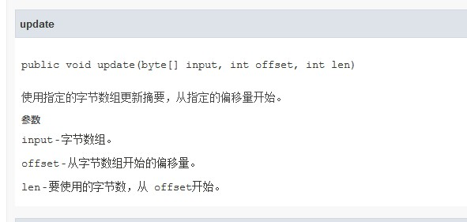
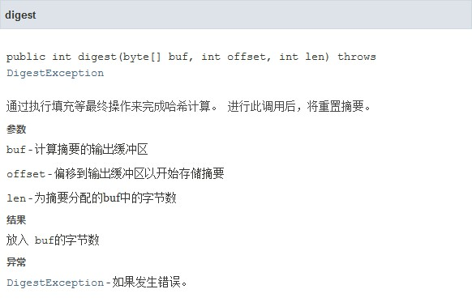

### Hash关键代码

#### 简单介绍

hash值可以说是文件的特征值,理论上讲,不同的文件有可能有不同的hash值,但是文件每一个二进制位的修改,都会导致hash值的变化,而且当hash值的取值空间足够大时,出现两个不同文件出现相同hash值这样的概率就变得几乎可以忽略不计.

##### 重点MD5和Hash的区别

- hash算法表示的是散列算法,散列算法是有很多种的,而MD5算法就是Hash算法的一种.常见的hash算法还有sha1,sha2
- MD5也叫做信息摘要算法,但是其实其算法复杂度还是不够的,容易被暴力破解,散列算法的破解是指找到一个明文,算出来的MD5值和已知的这个MD5值一样,而不是指还原回原文

#### 关键代码

##### 存在的问题

- 这个程序被设置成一次计算就结束
- 类划分还不够仔细

##### 代码

MessageDigest类

- update方法:更新得到的是128位密钥,不要忘记



- digest方法




```java
    public static String getFileMD5(File file) {    
        //获取MD5
        BigInteger bigInt = null;
        try {
            FileInputStream fis = new FileInputStream(file);
            //使用java类
            MessageDigest md = MessageDigest.getInstance("MD5");
            byte[] buffer = new byte[1024];
            int length = -1;
            while ((length = fis.read(buffer, 0, 1024)) != -1) {
                md.update(buffer, 0, length);
            }
            bigInt = new BigInteger(1, md.digest());
        } catch (FileNotFoundException e) {
            e.printStackTrace();
        } catch (NoSuchAlgorithmException e) {
            e.printStackTrace();
        } catch (IOException e) {
            e.printStackTrace();
        }
        return bigInt.toString(16);
    }
```

```
```

