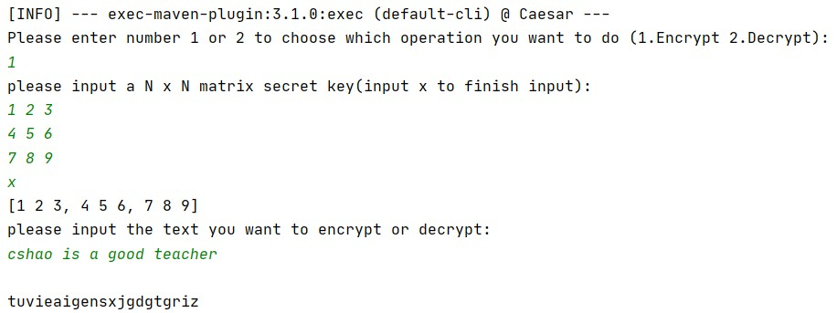
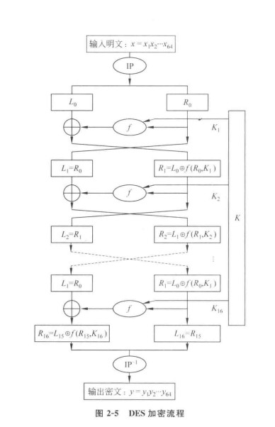
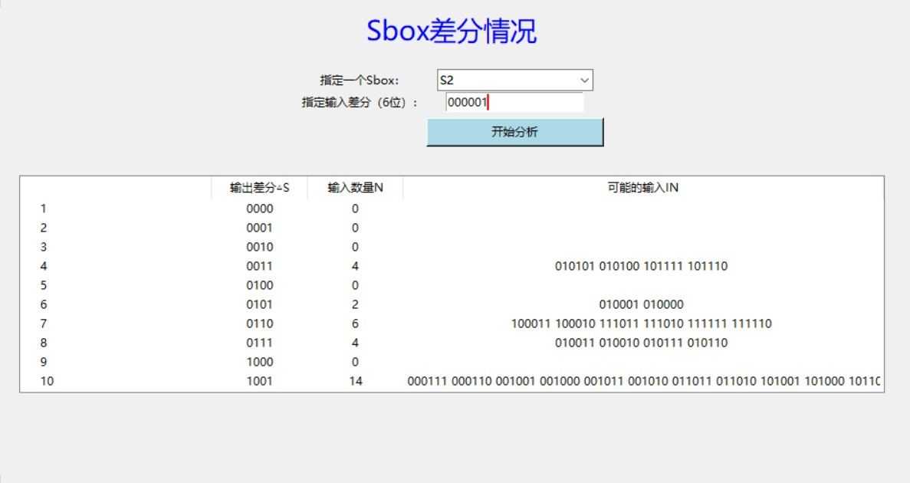
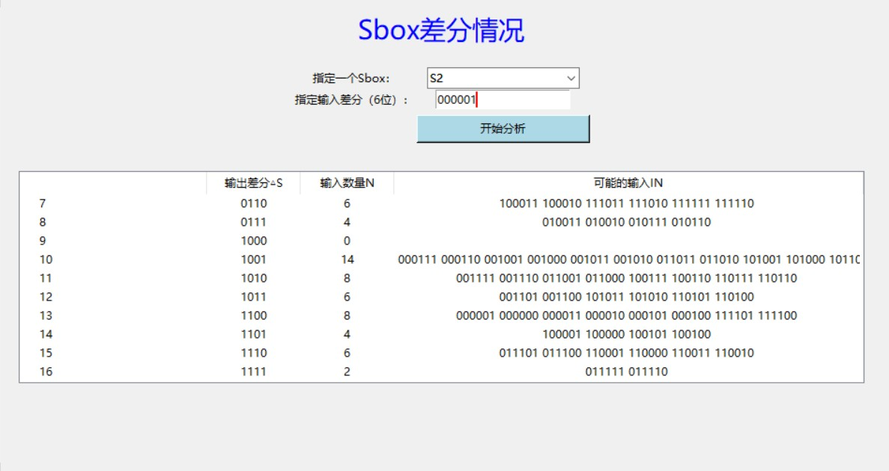
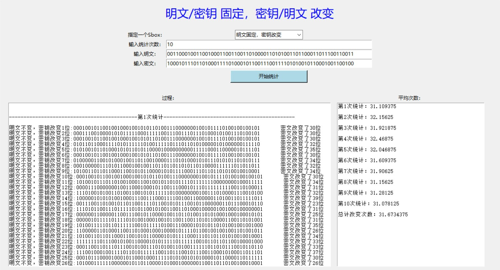
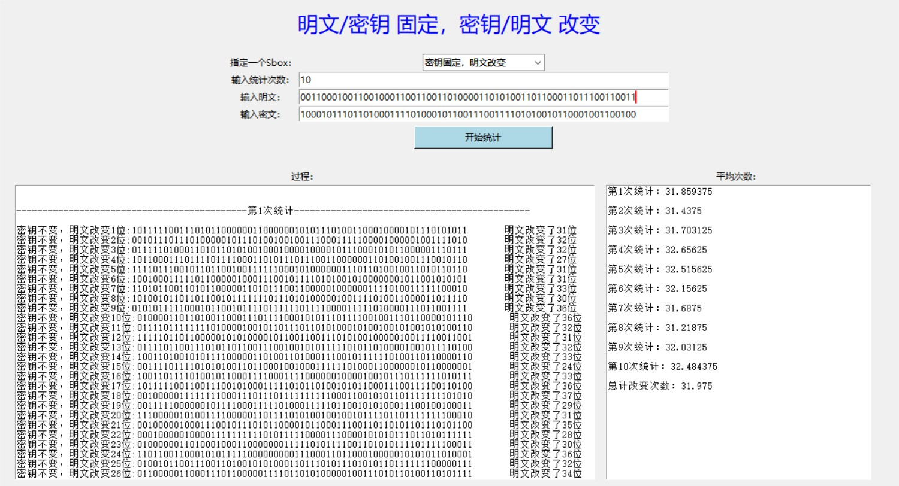
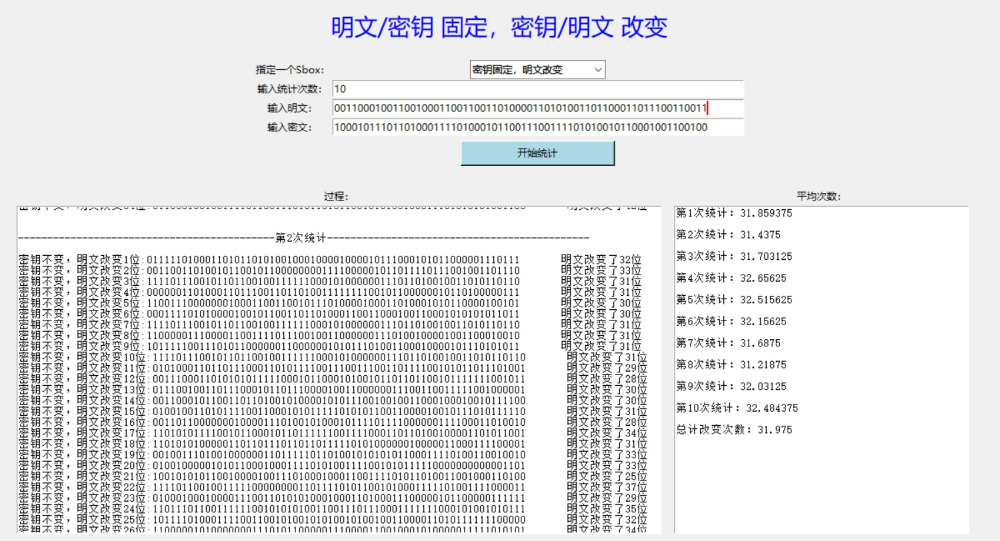

[toc]

### 利用异或实现加解密

##### 算法基本原理

异或的本质,做加法,相同为0,相异为1.

一个数和另一个数做两次异或之后是其本身.

- 第一次0^1=1   

- 第二次1^1=0

##### 关键代码截图


一个简单的异或,加密和解密都是调用xorutil模块下的这个

##### 输出结果截图

###### 加密解密普通文本文件

- 加密


- 解密


###### 加解密视频文件

- 加密


- 解密


### Caesar算法

##### 算法基本原理

- 时刻牢记按照加密过程中转换操作的原理,可划分为代换密码和置换密码.
  - 加密过程中,将明文中的每个或每组字符由另外一个或一组字符代替,形成密文叫做代换.
  - 只对明文字母进行重新编译,每个字母的位置发生改变,但是集合的元素数量并没有发生改变的叫做置换.
- 这里实现的Caesar密码是单表代换密码,是一种置换算法,算法很简单,就是对每个字母使用它之后的3个字母来代替.

- 实现统计特性之后,可以清楚的看到凯撒算法替换前后的凯撒特性还是保留了,所以当有足够多的密文分析之后,就可以分析出来到底密钥(移动了多少步)是多少

##### 输出结果截图

**加密**


---

**解密**


### Hill算法

##### 算法基本原理

- 首先每个字母指定为一个二十六进制数字
- m个连续的明文字母被看作m维向量,与一个m*m的加密矩阵相乘,再将得出的结果模26,得到m个密文字母.
- 将m个连续明文字母作为一个单元,被转换成等长的密文单元,注意加密矩阵必须是可逆的,否则就不可能译码.
- 这里老师只要求加密

##### 输出结果截图

明文补长时用a来补



### DES算法

##### 算法基本原理

- DES分组长度为64位,密钥长度为56位.加密和解密使用同一算法、同一密钥、同一结构。区别是加密和解密的过程中16个子密钥的应用顺序相反。

- 加密过程有三个阶段

  - 首先，64位的明文通过初始置换IP而被重新排列
  - 然后，进行16轮的迭代过程，每轮中都有置换和代换
  - 最后一轮迭代的输出有64位，是输入明文和密钥的函数，将其左半部分和右半部分互换后产生预输出
  - 预输出经过初始逆置换的作用产生64位的密文。

- 流程图

  

  - 最重要的是f函数做了什么和k是怎样来的

- f函数

  - 扩展变化:e变换:32位变48位
  - s盒变换:48位变32位
  - p盒:位置置换

- 密钥k的产生

  - 种子密钥是56位的,在每7位之后添加一个奇偶校验位,扩充成64位的
  - 置换选择pc-1:64位选56位出来
  - 每一轮循环左移一次
  - 每一轮从56位中挑选出48位,和pc-1一样。

##### 题目

```
1. 给定某个Sbox的输入差分情况下，计算所有输入对和所有Sbox输出差分的分布情况 
2. 统计DES算法在密钥固定情况，输入明文改变1位、2位，。。。64位时。输出密文位数改变情况。 
3. 统计DES算法在明文固定情况，输入密钥改变1位、2位，。。。64位时。输出密文位数改变情况。 
```

##### 做题结果

###### 1. 第一题

```
寻找满足**ΔSj(Bj)⨁Sj(Bj⨁ΔBj)=ΔSj**的Bj的集合。其中：Sj()为Sbox运算，ΔBj为输入差分（6位），ΔSj为输出差分（4位），BjBj为所有可能的输入。
```

以S2作为指定的sbox





###### 第二,三题

**明文固定,密钥改变时**




**密钥固定,明文改变**





###### 统计分析

无论是密钥固定、明文改变，还是明文固定、密钥改变；无论每次改变几位，最终密文的改变位数都为在32左右，也即总的64位的一半。每次都只变化50%的位数，使得企图通过该改变密钥或明文、根据密文变化来分析的攻击者根本难以分析出结果。正因这些顶级的·1统计学特征,使得DES能在那个时代称霸一时。

### DH密钥协商算法

##### 算法基本原理

- 用户A随机产生一个素数q和一个整数a,并且a是q的本原根,这两个数全世界都可以知道.接下来,就是如下图,所有流程都是直接明文交流的,最终在双方处可以产生一个共同的只有彼此知道的密钥.
  

- 根本原理

  

- 原根

  假设一个数g是p的原根

  

  

##### 作业要求的关键函数实现

```java
 // 判断n是否是素数
    public boolean isPrime(int n) {
        boolean flag = true;
        //求平方根
        int max = (int) Math.sqrt(n);
        for (int i = 2; i <= max; i++) {
            if (n % i == 0) {
                flag = false;
                break;
            }
        }
        return flag;
    }


 //计算a,b的最大公因子
    public int GCD(int a, int b) {
        int gcd = 0, c;
        if (a > b) {
            while (b != 0) {
                a = a % b;
                if (a < b) {
                    c = a;
                    a = b;
                    b = c;
                }
                gcd = a;
            }
        }
        if (a == b)
            gcd = a;
        else {
            c = a;
            a = b;
            b = c;
            while (b != 0) {
                a = a % b;
                if (a < b) {
                    c = a;
                    a = b;
                    b = c;
                }
                gcd = a;
            }
        }
        return gcd;
    }


 //计算b^n mod m
    public BigInteger ExpMod(BigInteger b, BigInteger n, BigInteger m) {
        BigInteger a = new BigInteger("1");
        //进制转换
        String t1 = n.toString(2);
        int[] N = new int[t1.length()];
        for (int i = 0; i <= t1.length() - 1; i++) {
            N[i] = Integer.parseInt(t1.substring(t1.length() - i - 1, t1.length() - i));
        }

        for (int j = 0; j <= t1.length() - 1; j++) {

            if (j != t1.length() - 1) {
                if (N[j] == 1)
                    a = (a.multiply(b)).remainder(m);
                if (N[j] == 0)
                    a = a.remainder(m);
                b = (b.multiply(b)).remainder(m);
            } else {
                if (N[j] == 1)
                    a = (a.multiply(b)).remainder(m);
                if (N[j] == 0)
                    a = a.remainder(m);
            }
        }
        return a;
    }
```

```java
/*最关键求本原根函数8/
   //得到p的所有生成元
    //从2开始暴力枚举,判断g^(p-1)mod(p)=1时是否指数为p-1.
    public ArrayList<Integer> getAllRoot(int p) {
        ArrayList<Integer> list = new ArrayList<>();
        int a = 2;
        int flag = 1;
        BigInteger temp;
        while (a < p) {
            flag = 1;
            temp = BigInteger.valueOf(a);

            //这个循环主要是用来判断会不会有其他的flag使得这个式子成立.
            while (flag < p) {
                if (temp.pow(flag).mod(BigInteger.valueOf(p)).intValue() == 1) {
                    break;
                }
                flag++;
            }

            //如果是的话,出来时肯定是break出来的,此时flag来不及继续++,值就是p-1
            if (flag == p-1) {
                list.add(a);
            }
            //计算下一个a,直到a=p-1;
            a++;
        }
        return list;

    }
    
    
    
        //有了生成元的全部集合后,判断g是不是模p成的生成元就很简单了
    public boolean isPrimerRoot(int g, int p) {
        Boolean is = false;
        ArrayList list = new DH().getAllRoot(p);
        for (int i = 0; i < list.size(); i++) {
            if (g == (Integer) list.get(i)) {
                is = true;
                break;
            }
        }
        return is;
    }
```


##### 输出结果截图

- q=97 a=37


- q=97 a=5


### RSA算法

---

##### 算法基本原理


##### 界面截图

##### 输出结果截图

### Hash算法

##### 算法基本原理

##### 界面截图

##### 输出结果截图

### 利用RSA,Hash实现数字签名和验证

##### 算法基本原理

##### 界面截图

##### 输出结果截图

