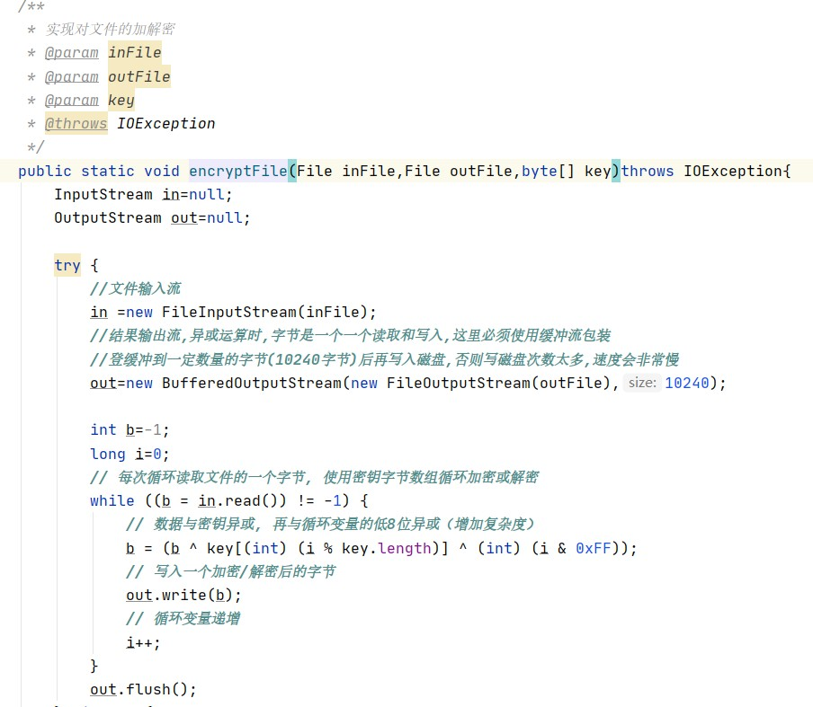
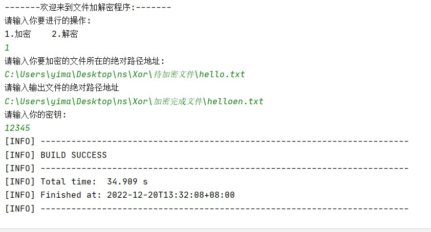
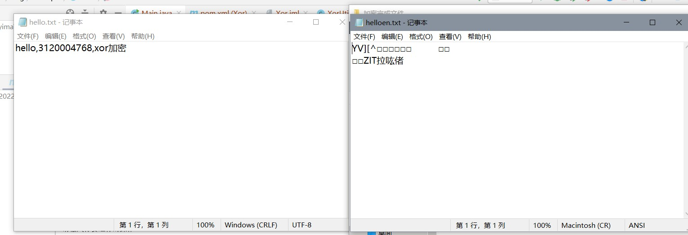
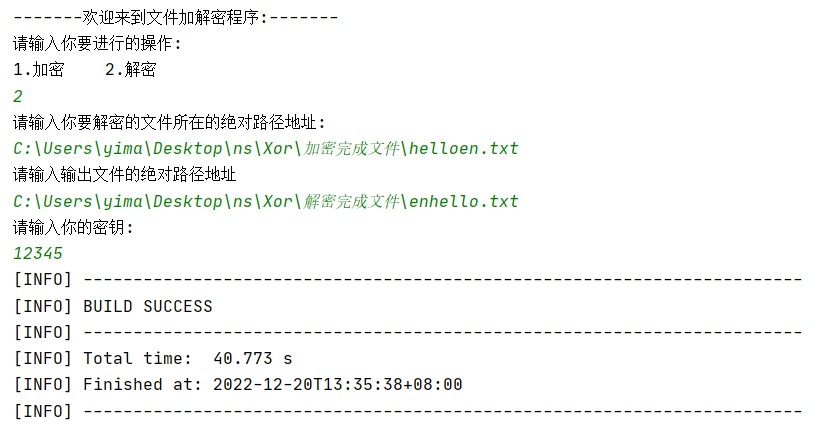
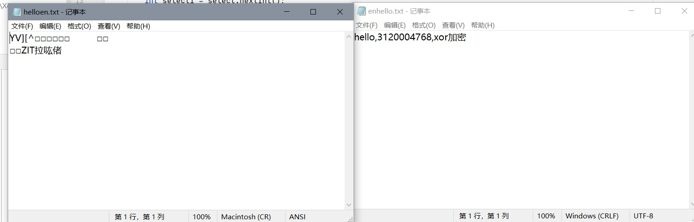
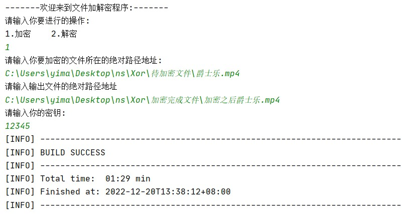
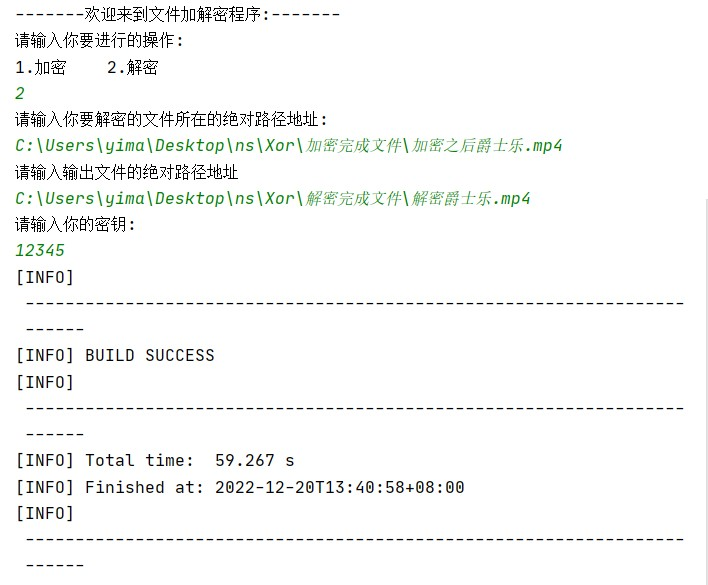
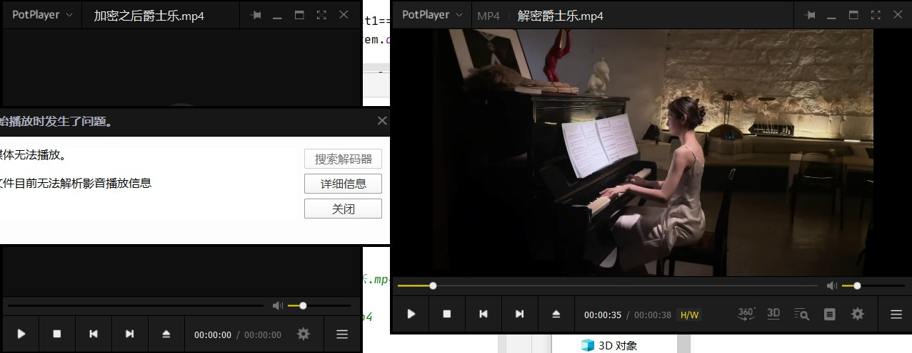
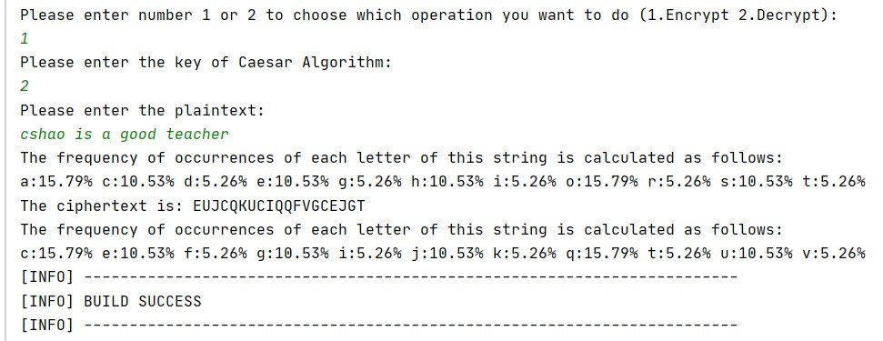
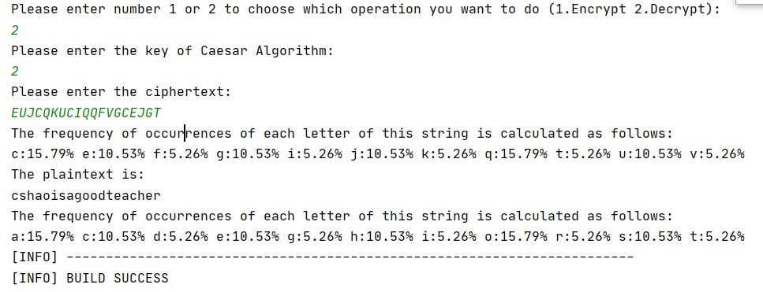

[toc]

### 利用异或实现加解密

##### 算法基本原理

异或的本质,做加法,相同为0,相异为1.

一个数和另一个数做两次异或之后是其本身.

- 第一次0^1=1   

- 第二次1^1=0

##### 关键代码截图

一个简单的异或,加密和解密都是调用xorutil模块下的这个

##### 输出结果截图

###### 加密解密普通文本文件

- 加密

- 解密

###### 加解密视频文件

- 加密

- 解密

### Caesar算法

##### 算法基本原理

- 时刻牢记按照加密过程中转换操作的原理,可划分为代换密码和置换密码.
  - 加密过程中,将明文中的每个或每组字符由另外一个或一组字符代替,形成密文叫做代换.
  - 只对明文字母进行重新编译,每个字母的位置发生改变,但是集合的元素数量并没有发生改变的叫做置换.
- 这里实现的Caesar密码是单表代换密码,是一种置换算法,算法很简单,就是对每个字母使用它之后的3个字母来代替.

- 实现统计特性之后,可以清楚的看到凯撒算法替换前后的凯撒特性还是保留了,所以当有足够多的密文分析之后,就可以分析出来到底密钥(移动了多少步)是多少

##### 输出结果截图

### Hill算法

##### 算法基本原理

##### 界面截图

##### 输出结果截图

### DES算法

##### 算法基本原理

##### 界面截图

##### 输出结果截图

### DH密钥协商算法

##### 算法基本原理

##### 界面截图

##### 输出结果截图

### RSA算法

##### 算法基本原理

##### 界面截图

##### 输出结果截图

### Hash算法

##### 算法基本原理

##### 界面截图

##### 输出结果截图

### 利用RSA,Hash实现数字签名和验证

##### 算法基本原理

##### 界面截图

##### 输出结果截图

