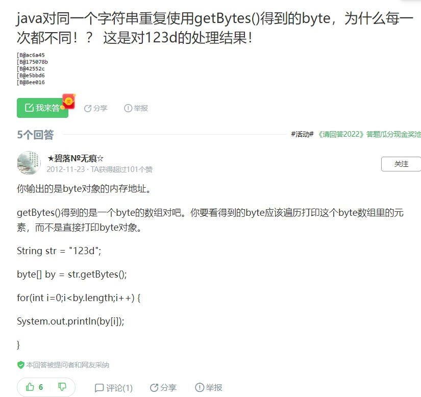
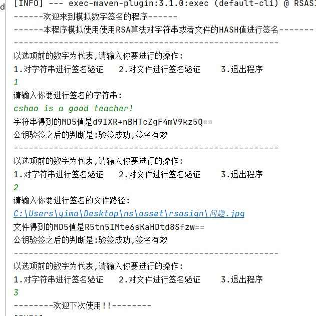
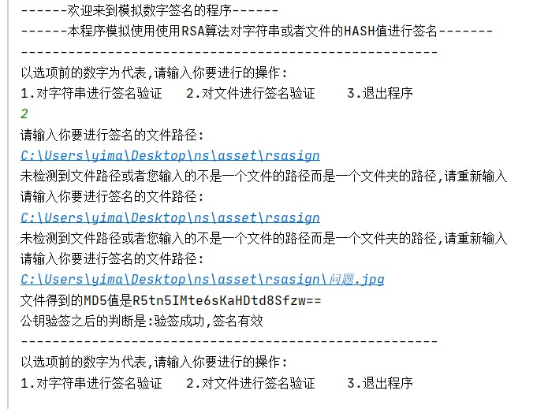

[toc]

### 数字签名和认证

#### 基础

计算文件的Hash值使用MD5算法

对文件使用加解密使用RSA非对称算法

#### java基础不牢导致的问题

- 应该使用base64编码来编码字节数组byte[],不然直接穿的数据可能会有错误

```java
 private static String CHARSETNAME="UTF-8";
    //字符串的获取MD5
    public static String getMD5(String string) {
        byte[] bytes =null;
        try {
            
            bytes = string.getBytes(CHARSETNAME);
            MessageDigest md5 = MessageDigest.getInstance("MD5");
            
            byte[] digest = md5.digest(bytes);
            return Base64.getEncoder().encodeToString(digest);
       
        
        } catch (Exception e) {
            e.printStackTrace();
        }
        return null;
    }
```

- String的getbyte方法问题

  相同的字符串却getbyte之后打印出来的数据却不一样?为什么啊

  

  

#### 代码说明

##### 主程序MAIN结构

```
	//询问程序
    public void ASK()
    //向用户获取字符串
    public String getUserString()
    //模拟字符串签名过程
    public void simulateString()
    
    //用户输入要判断的文件路径
    public String getFileString()
    //测试用户输入的是不是一个文件的路径
    public boolean isFile(String fileRoute)
    //模拟文件的签名和认证
    public void simulateFile()
    
    main()
    
```

##### 实现功能

1. 先获取字符串或者文件的MD5值
2. 使用RSA签名:私钥签名,公钥验证,模拟这个过程

##### 关键代码

RSA模块关键代码

```java
 		/**
         * 私钥签名（数据）: 用私钥对指定字节数组数据进行签名, 返回签名信息
         */
        public static byte[] sign(byte[] data, PrivateKey priKey) throws Exception {
            // 根据指定算法获取签名工具
            Signature sign = Signature.getInstance(SIGNATURE_ALGORITHM);

            // 用私钥初始化签名工具
            sign.initSign(priKey);

            // 添加要签名的数据
            sign.update(data);

            // 计算签名结果（签名信息）
            byte[] signInfo = sign.sign();

            return signInfo;
        }

		/**
         * 公钥验签（数据）: 用公钥校验指定数据的签名是否来自对应的私钥
         * 无论是文本,还是文件,在本工程中都假设其明文正常传输,然后计算出和原来相同的MD5值
         * 传入的是明文计算出来的MD5哈希值,以及私钥加密的MD5哈希值,公钥
         * 私钥加密的信息解密之后,若其MD5值与传进来的MD5值相同,不就证明没做修改嘛
         */
        public static boolean verify(byte[] data, byte[] signInfo, PublicKey pubKey) throws Exception {
            // 根据指定算法获取签名工具
            Signature sign = Signature.getInstance(SIGNATURE_ALGORITHM);

            // 用公钥初始化签名工具
            sign.initVerify(pubKey);

            // 添加要校验的数据
            sign.update(data);
            
            // 校验数据的签名信息是否正确,
            // 如果返回 true, 说明该数据的签名信息来自该公钥对应的私钥,
            // 同一个私钥的签名, 数据和签名信息一一对应, 只要其中有一点修改, 则用公钥无法校验通过,
            // 因此可以用私钥签名, 然后用公钥来校验数据的完整性与签名者（所有者）
            boolean verify = sign.verify(signInfo);

            return verify;
        }

```


MD5模块关键模块

```java
 //字符串的获取MD5,返回String类型的MD5值
    public static String getMD5(String string) {
        byte[] bytes =null;
        try {
            bytes = string.getBytes(CHARSETNAME);
            MessageDigest md5 = MessageDigest.getInstance("MD5");
            byte[] digest = md5.digest(bytes);
            return Base64.getEncoder().encodeToString(digest);
        } catch (Exception e) {
            e.printStackTrace();
        }
        return null;
    }
    
    
    //输入文件,获取文件的MD5,以String类型返回
    public static String getFileMD5(File file) {
        BigInteger bigInt = null;
        try {
            FileInputStream fis = new FileInputStream(file);
            //使用java类
            MessageDigest md = MessageDigest.getInstance("MD5");
            byte[] buffer = new byte[1024];
            int length = -1;
            while ((length = fis.read(buffer, 0, 1024)) != -1) {
                md.update(buffer, 0, length);
            }
            bigInt = new BigInteger(1, md.digest());
        } catch (FileNotFoundException e) {
            e.printStackTrace();
        } catch (NoSuchAlgorithmException e) {
            e.printStackTrace();
        } catch (IOException e) {
            e.printStackTrace();
        }
        return bigInt.toString(16);
    }
    
    
```

#### 程序实现界面说明



- 程序输入3才会退出程序,否则一直会进行循环的验证过程

- 输入2时输入的是文件的绝对路径,若没读到文件路径或者文件不存在,则会一直要求用户重新输入,对他的选择负责

  

#### 未解决的问题

- 图形化界面,全部的作业图形化界面都没做
- 本程序的过程略显短,应该给出私钥加密得到的MD5值,然后再输出一下公钥解密得到的公钥值.但是由于signature类下没有公钥解密后返回byte[]的方法,都是直接使用公钥验证之后返回比较值签名有效与否的boolean值的方法,故在此不做实现.