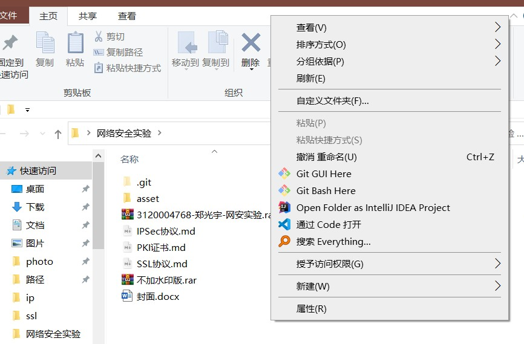
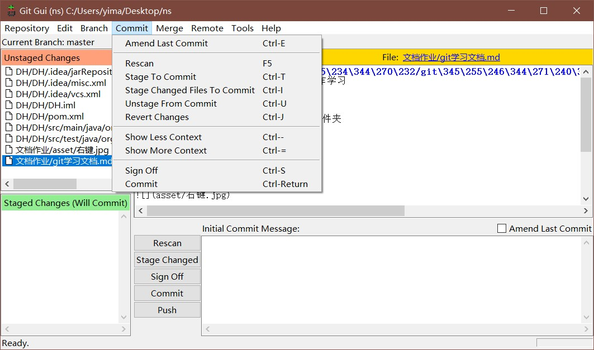
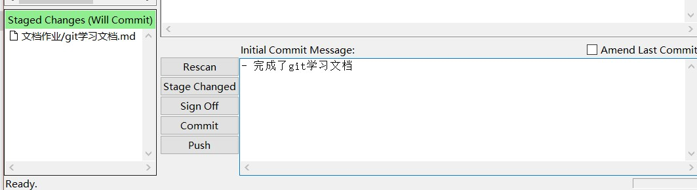
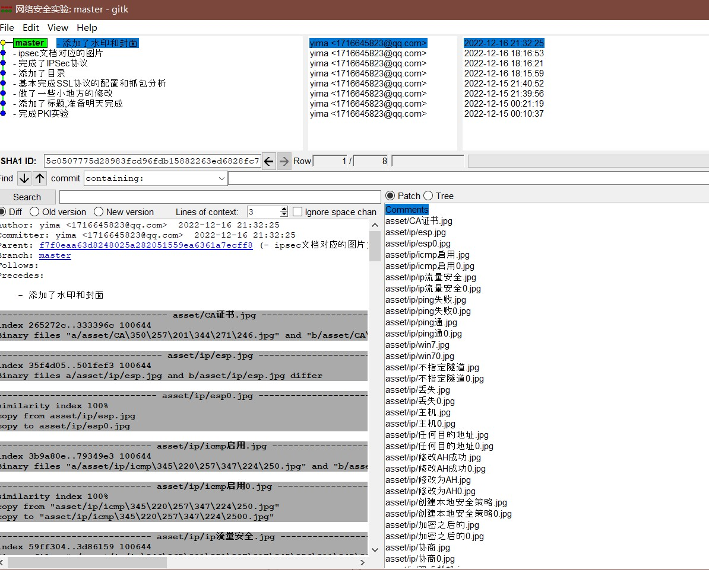

### 第一次网络安全作业 - git的基本操作学习

---

#### 安装好后,打开想要交给git管理的文件夹

右键

选择gui here就是打开图形化界面

选择bash here 就是打开命令行窗口

#### git init

打开bash,输入这个命令初始化仓库.

#### 打开gui窗口

##### 选中要提交到暂存区的文件,然后点击commit,选择Stage to commit来提交至暂存区

add的快捷键是ctrl+T

添加到暂存区之后,可以在message区中写提交的是什么工作

然后点击commit,就把该文档提交给git管理了.点击repository-visualize master's files查看此时的主分支

如若要推到远程仓库,和远程仓库使用ssh认证连接之后

**git remote add origin +ssh链接**   用来连接到远程仓库

**git clone  + ssh链接** 这是直接拉取远程仓库的语句

**git pull origin "分支名"** 拉取远程仓库的分支到本地,并且并入本地的分支.

**git push origin "分支名"** 推本地文件到远程仓库
